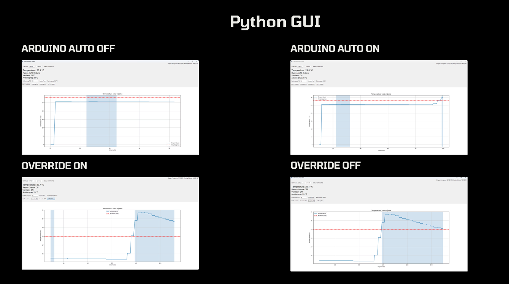
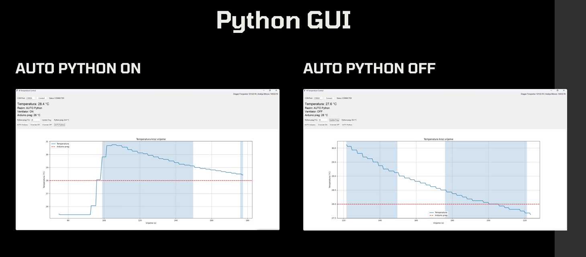

# Temperature Monitoring & Fan Control System

A real-time temperature monitoring and automatic fan control system built using an **ESP32**, **Arduino Uno**, infrared communication and a **Python desktop application**.

The system measures temperature using a DS18B20 sensor, transmits temperature and threshold data wirelessly through infrared communication, controls a fan using a relay, and provides real-time monitoring and control through a Python GUI.

## Overview

The project consists of three main components:

- **ESP32 transmitter** — reads the temperature and user-defined threshold and sends the data over infrared.
- **Arduino Uno receiver/controller** — receives the IR data, controls the fan, LCD and buzzer, and communicates with the computer.
- **Python GUI** — displays real-time system data, plots temperature history and allows the user to control the operating mode.

The system supports both autonomous hardware control and software-based control from the Python application.

## System Architecture

```text
DS18B20 Temperature Sensor
           |
           v
         ESP32
           |
     Temperature + Threshold
           |
    NEC IR Transmission
           |
           v
      Arduino Uno
       /    |    \
      /     |     \
   Relay   LCD   Buzzer
     |
    Fan
     |
     +----------------+
                      |
                  USB Serial
                      |
                      v
                Python GUI
                      |
            Real-Time Monitoring
            Fan Control / Modes
            Temperature Graph
```

## ESP32 Transmitter

The ESP32 acts as the sensor and infrared transmitter.

### Connected Components

- **DS18B20 temperature sensor** — GPIO15
- **Potentiometer** — GPIO34
- **IR LED transmitter** — GPIO4

### Functionality

The ESP32:

1. Reads the current temperature from the DS18B20 sensor.
2. Reads the potentiometer value.
3. Maps the potentiometer value to a temperature threshold between **15 °C and 50 °C**.
4. Encodes the temperature and threshold into separate 32-bit values.
5. Sends both values to the Arduino Uno using NEC infrared transmission.

Two markers are used to distinguish the transmitted data:

```text
0x10000000 -> Temperature
0x20000000 -> Temperature threshold
```

The temperature is multiplied by 100 before transmission so that decimal values can be represented as an integer.

## Arduino Uno Receiver

The Arduino Uno acts as the central controller of the system.

### Connected Components

- **IR receiver** — Pin 11
- **Relay / Fan control** — Pin 7
- **Buzzer** — Pin 3
- **16x2 I2C LCD**
- **USB Serial connection to PC**

### Functionality

The Arduino:

- Receives the temperature and threshold from the ESP32.
- Decodes the custom IR data format.
- Controls the relay connected to the fan.
- Displays temperature, threshold, operating mode and fan state on the LCD.
- Uses the buzzer to indicate changes in fan state.
- Sends system information to the Python application every 500 ms.
- Receives control commands from the Python application.

The serial data sent to Python uses the following format:

```text
temperature,threshold,fan_state,mode
```

Example:

```text
27.50,30,0,0
```

## Operating Modes

The system supports four operating modes.

### 1. AUTO Arduino

Arduino automatically controls the fan using the temperature threshold received from the ESP32.

```text
Temperature >= Threshold -> Fan ON
Temperature < Threshold  -> Fan OFF
```

### 2. Override ON

The fan is forced ON regardless of the current temperature.

### 3. Override OFF

The fan is forced OFF regardless of the current temperature.

### 4. AUTO Python

The Python application controls the fan using a separate software-defined temperature threshold.

When the measured temperature reaches the Python threshold, the application sends:

```text
FAN_ON
```

Otherwise:

```text
FAN_OFF
```

## Python Desktop Application

The desktop application is built using **Tkinter** and communicates with the Arduino Uno through a serial connection.

### Features

- Manual COM port selection
- Connection status indicator
- Current temperature display
- Arduino temperature threshold display
- Fan state display
- Current operating mode display
- Adjustable Python temperature threshold
- Real-time temperature graph
- Visualization of periods when the fan is active
- Manual fan override
- Arduino automatic mode
- Python automatic mode
- Background serial communication using a separate thread

The application uses:

- `tkinter`
- `pyserial`
- `matplotlib`
- `threading`
- `collections.deque`

## Python GUI

The Python desktop application provides real-time monitoring and control of the complete system.

It displays the current temperature, fan state, active operating mode and temperature threshold while plotting temperature changes over time.

The shaded areas on the graph indicate periods when the fan is active.

### Arduino and Override Modes

The application supports automatic Arduino-based fan control as well as manual ON/OFF override modes.



### Python Automatic Mode

In `AUTO Python` mode, the desktop application compares the measured temperature with a software-defined threshold and sends fan control commands to the Arduino.



## Communication Flow

```text
DS18B20
   |
   v
ESP32
   |
   | Temperature
   | Threshold
   v
NEC Infrared
   |
   v
Arduino Uno
   |
   +--> Automatic Fan Control
   |
   +--> LCD
   |
   +--> Buzzer
   |
   v
USB Serial
   |
   v
Python GUI
   |
   +--> Real-Time Graph
   +--> Mode Selection
   +--> Python Threshold
   +--> Manual Fan Control
```

## Repository Structure

```text
temperature-fan-control/
│
├── firmware/
│   ├── arduino-uno/
│   │   └── Arduino_Uno.ino
│   │
│   └── esp32/
│       └── ESP_32_Final.ino
│
├── python-gui/
│   └── main.py
│
├── docs/
│   └── setup-guide.txt
│
├── images/
│   └── python-gui.png
│
├── requirements.txt
├── .gitignore
└── README.md
```

## Requirements

### Python

Python 3.11 or newer is recommended.

Install the required Python libraries:

```bash
pip install pyserial matplotlib
```

Or use:

```bash
python -m pip install pyserial matplotlib
```

### Arduino Uno Libraries

The Arduino firmware requires:

- IRremote
- LiquidCrystal_I2C

### ESP32 Libraries

The ESP32 firmware requires:

- IRremote
- DallasTemperature
- OneWire

## Running the Project

The recommended startup order is:

1. Power on the ESP32.
2. Power on the Arduino Uno.
3. Connect the Arduino Uno to the computer.
4. Start the Python application.

```bash
python python-gui/main.py
```

Select the correct COM port in the application and click **Connect**.

For detailed installation and setup instructions, see:

[`docs/setup-guide.txt`](docs/setup-guide.txt)

## Serial Commands

The Python application sends the following commands to the Arduino:

| Command | Function |
|---|---|
| `A` | Enable AUTO Arduino mode |
| `ON` | Force fan ON |
| `OFF` | Force fan OFF |
| `P` | Enable AUTO Python mode |
| `FAN_ON` | Turn fan ON in Python mode |
| `FAN_OFF` | Turn fan OFF in Python mode |

## Technologies

### Embedded Systems

- ESP32
- Arduino Uno
- DS18B20
- IR transmitter and receiver
- Relay
- Potentiometer
- I2C LCD
- Buzzer

### Programming

- C / C++ (Arduino)
- Python

### Communication

- NEC Infrared Protocol
- Serial Communication
- Custom data encoding

### Python

- Tkinter
- PySerial
- Matplotlib
- Threading

## Project Highlights

This project demonstrates the integration of multiple hardware and software technologies into a single real-time system.

Key concepts explored include:

- Sensor data acquisition
- Wireless infrared communication
- Custom data encoding
- Microcontroller-to-microcontroller communication
- Automatic control systems
- Relay-based actuator control
- Serial communication
- Multithreaded desktop applications
- Real-time data visualization
- Hardware-software integration

## Possible Future Improvements

- Automatic serial port detection
- Saving temperature history to a file or database
- Configurable alarm levels
- Improved error handling for lost IR communication
- Automatic serial reconnection
- Additional sensors
- Remote monitoring over Wi-Fi
- Improved GUI design

## Authors

**Andrija Mitrović**  
**Dragan Forspreher**

Computer Engineering students at **Računarski fakultet (RAF), Belgrade**.
